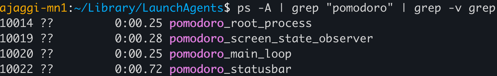

# pomodoro-hard-mode
A [pomodoro](https://en.wikipedia.org/wiki/Pomodoro_Technique) timer that is hard to ignore.  
Different from other gazillion timers because it will force you to take a break, no matter you like it or not.  
Useful for stubborn/stupid people like me who ignore normal soft timers despite being suffering from neck/back/eyes strain.

## Intro

- A python script running in an infinite loop, which will keep pestering you periodically to force you to take breaks.
- It can currently do the following tricks:
  - Display a dialog box which is hard to ignore/hide/minimize.
  - Play a sound on repeat.
  - Turn screen off.
  - Display remaining time (in minutes) on the statusbar.
  
- It can also pause itself while the screen is locked, to prevent the dialog and sound while the laptop is locked and unattended.
- You are supposed to work without distractions for 25 minutes and then take a break for 5 minutes.
- Note that when the screen is unlocked, the timer starts afresh from beginning, assuming that you would have already taken a break while you're gone.
- The script will sleep for 25 minutes if you press `OK`, and 5 minutes if you press `Snooze` before pestering you.  
- The time intervals are configurable in `main_loop.py`.
- To not the see the dialog ever again, press `Finish` to kill the script.
- Right now only supported on Mac.
- **Tip**: Snooze can be used as both: To extend the current working session for 5 minutes, or to just measure the 5-minute break.


## Setup

- Install dependencies:  
  `>> python3 -m pip install setproctitle rumps pyobjc`
- Execute it manually and run in background:
  ```
  cd src
  nohup python3 pomodoro.py &!
  ```
- To check if its running, execute `ps -A | grep "pomodoro" | grep -v grep`.  
  You should see 4 processes.  


- To make it run automatically at startup:
  - Modify the path on line 10 and 19 in the `.plist` file to point to the `pomodoro.py` script and its parent directory respectively.
  - Copy the plist file to `~/Library/LaunchAgents`.

## Todo
- Add support for Windows and Linux:
  - If native screen state change observer API is missing, then create one using timer loops.
  - Find out equivalent commands for playing sound, turning off screen, displaying dialog.
- Get code reviewed.
- Make it configurable to turn off optional features like playing sound, turning screen off etc.